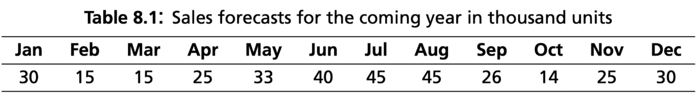
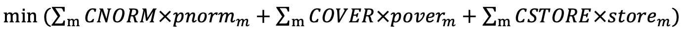
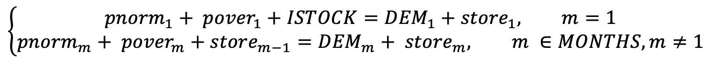
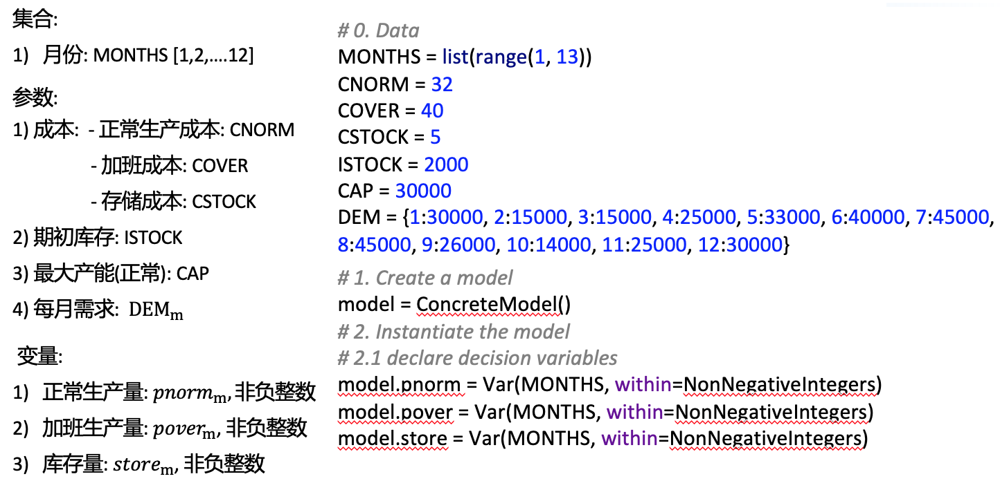
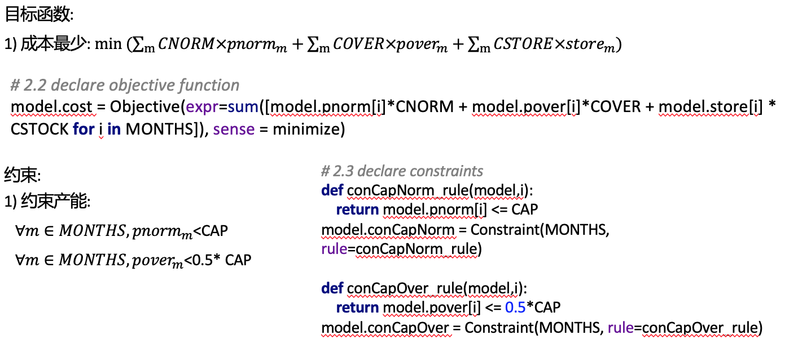
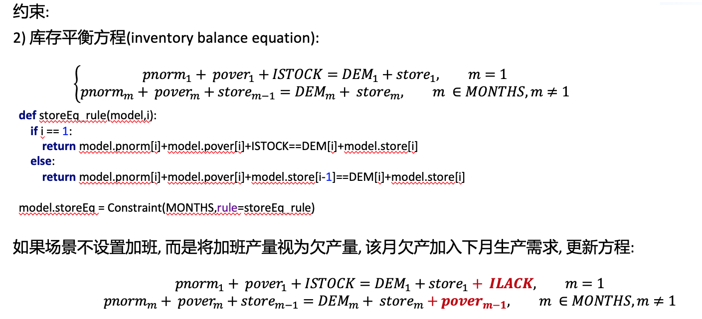

## 8.1 Planning the production of bicycles

### 案例描述：

​     一家公司生产自行车. 该公司现有未来12个月的销售量预测, 该公司每个月产能为30000辆, 正常生产成本为 EUR 32/辆, 可以通过加班将提升最多50%的产量, 成本提升为EUR 40/辆. 当前库存2000辆, 存储成本为EUR 5/辆每月. 

​    求接下来的十二个月中每个月需要生产和存储的产品量，以满足需求并最大程度地降低总成本.

### 建模

#### 集合: 

1)月份: MONTHS [1,2,….12]

#### 参数: 

1) 成本: - 正常生产成本: CNORM

​         \- 加班成本: COVER

​         \- 存储成本: CSTOCK

2) 期初库存: ISTOCK

3) 最大产能(正常): CAP

4) 每月需求: DEM_m

#### 变量:

1)正常生产量: pnorm_m, 非负整数

2)加班生产量: pover_m, 非负整数

3)库存量: store_m, 非负整数

#### 目标函数: 

1) 成本最少:

约束：

1）约束产能:

2）库存平衡方程(inventory balance equation):

### 代码实现

完整代码见.py文件

